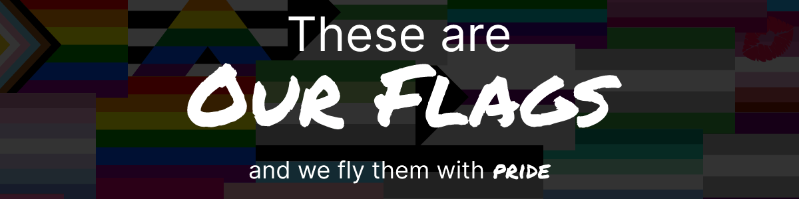
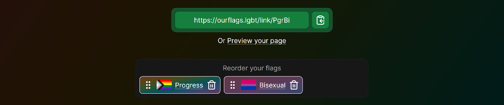

# [OurFlags.lgbt](https://ourflags.lgbt/)

Our Flags is a reference website for the flags used by the rainbow community. This site aims to break down barriers and allow people outside of the rainbow community to learn about identities and symbols without the initial awkward questions.

People can also select flags that represent themselves to get a link to a page summarising those flags. Members of the community often aren't defined by a single idea, so the links generated can have any combination of flags in any order.

## Contributing

Want to contribute to this project? Check out the [contributing guidelines](./docs/CONTRIBUTING.md) on where to get started.

### Contributors

<!-- ALL-CONTRIBUTORS-LIST:START - Do not remove or modify this section -->
<!-- prettier-ignore-start -->
<!-- markdownlint-disable -->

<!-- markdownlint-restore -->
<!-- prettier-ignore-end -->

<!-- ALL-CONTRIBUTORS-LIST:END -->

## License

This repository has a mixed license. Code is made available under the [MPL-2.0 license](https://www.mozilla.org/en-US/MPL/2.0/), and text in the `content/` directory is made available under the [CC BY-SA 4.0 license](https://creativecommons.org/licenses/by-sa/4.0/).

A quick (non-lawyer) summary.

- You may reuse parts of the code for your own purposes as long as those parts continue to follow the MPL.
  - This includes modifications, which must remain MPL.
  - You must provide attribution when doing so.
  - If the code is part of a larger work, the rest of the work does not have to be MPL.
- You may reuse parts of the text content of the site as long as those parts are under the same license (CC BY-SA 4.0).
  - You must provide attribution when doing so.
  - A direct link back to [ourflags.lgbt](https://ourflags.lgbt/) would be preferred.

---

