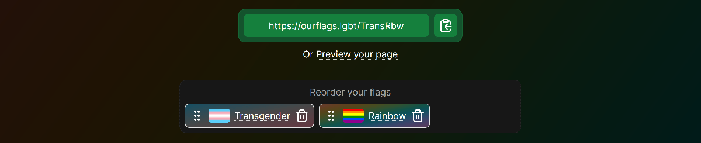

# [MyFlags.lgbt](https://myflags.lgbt/)

My Flags is a website to generate shareable links with information about pride flags. Members of the community aren't always defined by a single idea, and the ability to change the labels and symbols we use is a ley part of many people's discovery of who they are. This site aims to break down barriers and allow people outside of the rainbow community to learn about queer identities and symbols without the initial awkward questions.

## Contributing

Want to contribute to this project? Check out the [contributing guidelines](./docs/CONTRIBUTING.md) on where to get started.

### Contributors

If you make changes to this project, add your name and a link to your GitHib profile here.

## License

This repository has a mixed license. Code is made available under the [MPL-2.0 license](https://www.mozilla.org/en-US/MPL/2.0/), and text in the `content/` directory is made available under the [CC BY-SA 4.0 license](https://creativecommons.org/licenses/by-sa/4.0/).

A quick (non-lawyer) summary.

- You may reuse parts of the code for your own purposes as long as those parts continue to follow the MPL.
  - This includes modifications, which must remain MPL.
  - If the code is part of a larger work, the rest of the work does not have to be MPL.
- You may reuse parts of the text content of the site as long as those parts are under the same license (CC BY-SA 4.0).
  - You must provide attribution when doing so.
  - A direct link back to [myflags.lgbt](https://myflags.lgbt/) would be very much appreciated.

